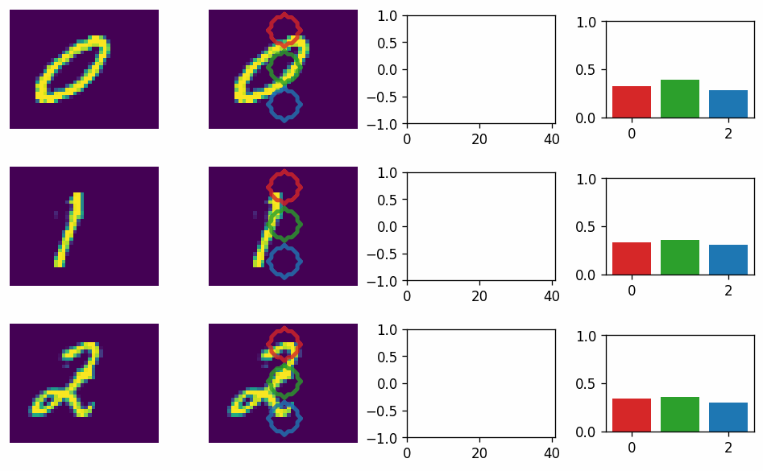
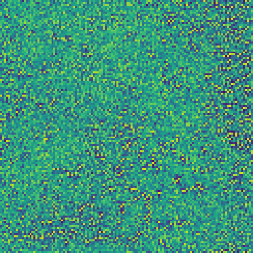
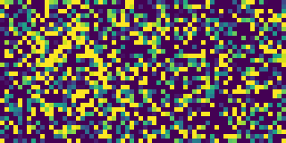

# 🦠 Neural cellular-automata experiments

A repo containing notebooks on experiments with neural cellular automata.

## Main ideas explored

- Optimize for information preservation in a noisy environment - generate macro patters in the NCA simulation.
- Optimize an NCA to do classification, by activating a specific part of the simulation with high potential.
- Optimizing an NCA as an embodied auto-encoder - translation + squeeze and reconstruct.

## Some notable examples

<table>
  <tr>
    <td>Classification</td>
    <td></td>
  </tr>
  <tr>
    <td>Macro pattern generation</td>
    <td></td>
  </tr>
  <tr>
    <td>Soliton</td>
    <td></td>
  </tr>
</table>

## Presented at [ALIFE24](https://2024.alife.org/detailed_program.html#postersday2)

- Poster [Google Slides](https://docs.google.com/presentation/d/1VtJ9-sqPK2_n1cC9SwA2SxAglqs_vTcBzSmWKe2UQaQ/edit?usp=sharing)/[PDF](https://drive.google.com/file/d/1icH9ipHgzvZdS5OCtZnvEX_1Gg2Wud2n/view?usp=sharing)
- [X Post](https://x.com/ilzhechev/status/1816725317576241177)
